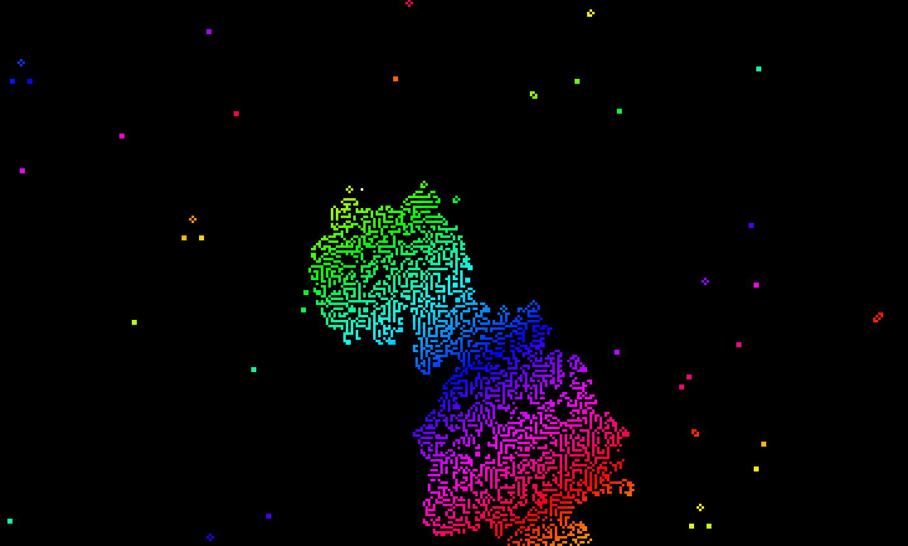
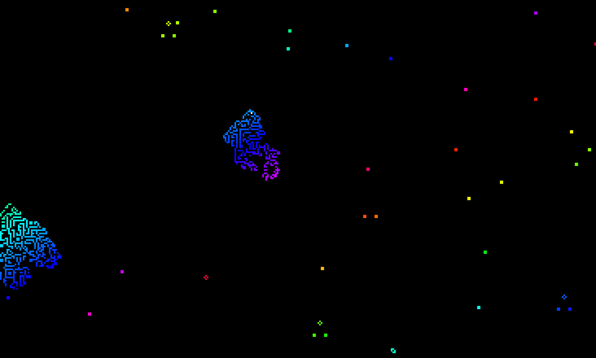

# Game of Life
> A pretty simulation of *Conway's Game of Life*.

 

To run the simulation, see `Releases`. \
**NOTE:** Currently, only **Windows** is supported.

### Controls
 - `ESC` as an alternative to closing the window.
 - `ENTER` to reset the simulation.
 - `ARROW KEYS` to move around a **white** cursor
 - `SPACE` to place living cells around the cursor.

 

### Screenshots

    Developed by <b>Connell Reffo</b> in <b>2024</b>

